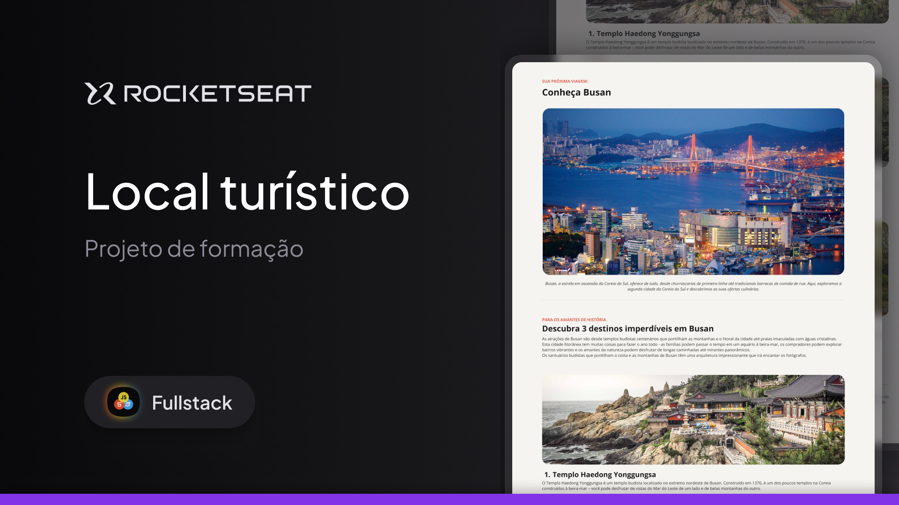

# Formação Full-Stack: Local Turístico

 

Este projeto consiste em uma página web desenvolvida utilizando HTML e CSS. Esta página exibe informações turísticas sobre a cidade de Busan, na Coreia do Sul.
 

Os seguintes tópicos são trabalhados nesta aplicação: 

<ul>
  <li>Estrutura HTML</li>
  <li>Estilizações com CSS</li>
  <li>Fontes</li>
  <li>Espaçamentos</li>
  <li>Imagens</li>
  <li>Listas desordenadas</li>
  <li>Cores dos textos</li>
  <li>Pesos dos textos</li>
</ul>

Este projeto faz parte da formação Full-Stack da <a href="https://www.rocketseat.com.br">Rocketseat</a>.
